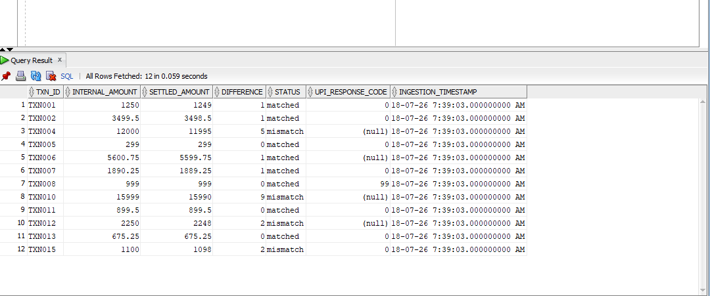

# Decentro Data Pipeline

A simple data ingestion and reconciliation pipeline using CSV/JSON source files and Parquet output.

## Project Structure

- `src/main.py` - pipeline entrypoint
- `src/ingestion_layer/ingestion.py` - loads source files and writes Parquet bronze files
- `src/data_transfomation/processing.py` - loads bronze Parquet files, reconciles data, and writes a silver Parquet file
- `src/dq_layer/dq.py` - data quality checks and bad-data Parquet output
- `src/utils/file_reader.py` - file reader utility with CSV/JSON/Parquet support
- `src/utils/file_writer.py` - writes Parquet output
- `src/logger/log.py` - singleton logger implementation
- `src/config/file_config.py` - file path and type configuration
- `src/bronze/` - generated bronze Parquet files
- `src/silver/` - generated reconciled Parquet file
- `src/bad_data/` - generated Parquet files containing bad records

## Prerequisites

- Python 3.10+ (3.11 recommended)
- `pip`

## Setup

1. Create and activate a virtual environment from the repository root:

   PowerShell:
   ```powershell
   python -m venv env
   .\env\Scripts\Activate.ps1
   ```

   Command Prompt:
   ```cmd
   python -m venv env
   .\env\Scripts\activate.bat
   ```

2. Install dependencies:

   ```powershell
   pip install pandas pyarrow
   ```

3. Optional: install DuckDB for SQL-style Parquet queries:

   ```powershell
   pip install duckdb
   ```

## Usage

Run the pipeline from the repository root using module execution:

```powershell
python -m src.main
```

This will:

- ingest source data from `src/src_files/`
- write Parquet bronze files to `src/bronze/`
- run data quality checks and write bad records to `src/bad_data/`
- reconcile the data and write `src/silver/reconciled.parquet`

## Data Quality

The pipeline currently validates bronze datasets for common schema violations such as:

- negative `amount` values in `transactions`
- negative `settled_amount` values in `settlements`

Bad records are written to:

- `src/bad_data/bad_transactions.parquet`
- `src/bad_data/bad_settlements.parquet`

You can inspect these files using pandas or DuckDB.

## Notes

- Output Parquet files are overwritten on each run.
- The pipeline reads source files from `src/src_files/`.
- The reconciled output schema includes:
  - `txn_id`
  - `internal_amount`
  - `settled_amount`
  - `difference`
  - `status`
  - `upi_response_code`
  - `ingestion_timestamp`

## Querying the Parquet file with SQL

If you install `duckdb`, you can query the reconciled Parquet file directly:

```python
import duckdb

query = """
SELECT txn_id, internal_amount, settled_amount, difference, status
FROM 'src/silver/reconciled.parquet'
WHERE status = 'mismatch'
"""

df = duckdb.query(query).to_df()
print(df)
```

## Troubleshooting

- If `python -m src.main` fails with module import errors, make sure you run it from the repository root (`c:\Users\acer\Udit\decentro_project`).
- Use the virtual environment activation command before running the pipeline.


# Attached photo for the data laoded into the warehouse

